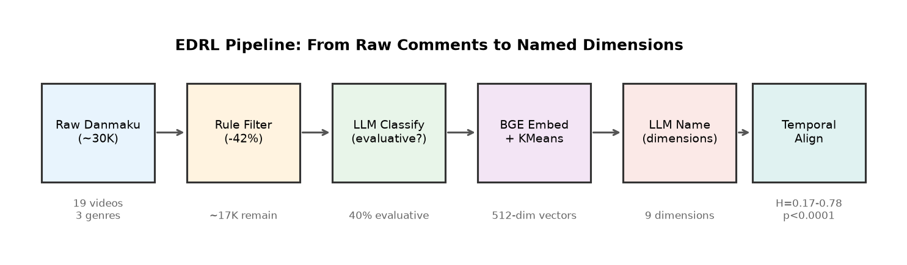
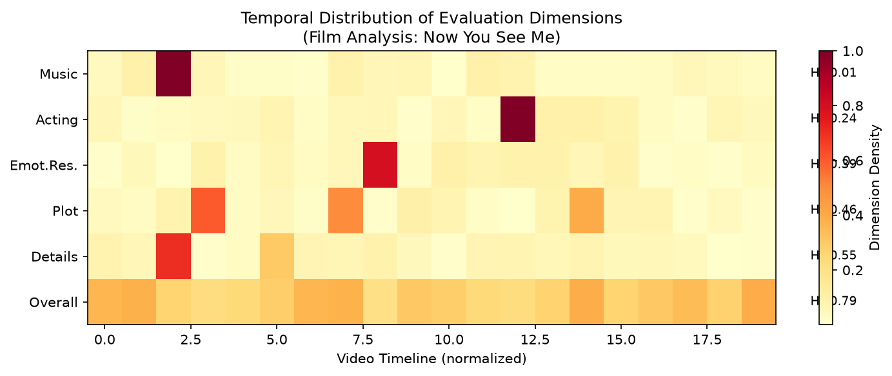
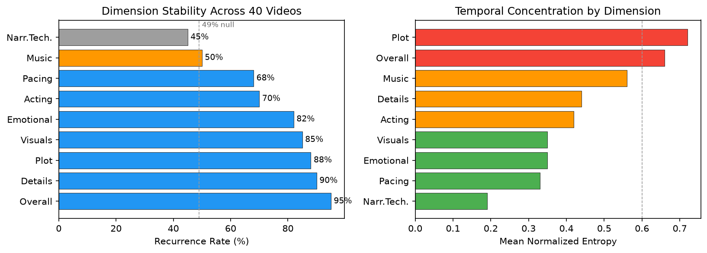
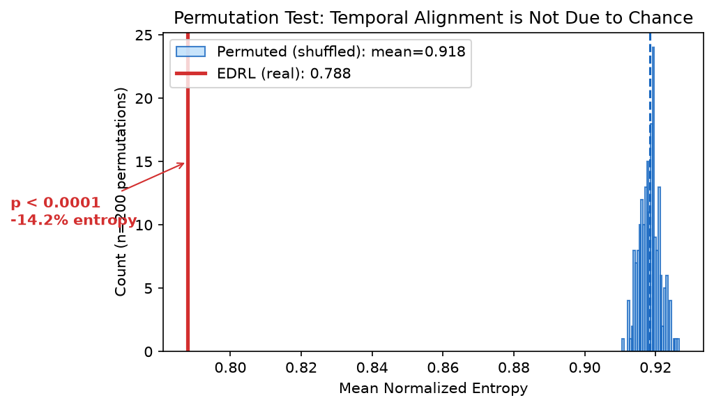

# Evaluation-Driven Representation Discovery: When Audience Reactions Reveal Content Structure Without Labels

**Zhi Liu (ailiheizi)**

## Abstract

We show that natural audience evaluations (e.g., real-time video comments/danmaku) contain sufficient semantic structure to automatically discover meaningful content dimensions—without any human-defined labels or feature engineering. By clustering the semantic embeddings of evaluative comments and aligning them with temporal content, we demonstrate that: (1) 9 interpretable evaluation dimensions emerge automatically (plot, acting, visuals, music, pacing, etc.); (2) the top 7 dimensions recur stably across 40 videos and 7 genres, with bootstrap 95% confidence intervals significantly above a random-assignment null model; (3) three independent annotators—two architecturally distinct models (DeepSeek, Gemini) and a human—agree on dimension labels (60–63%, 5.7× chance) and polarity (79–87%), confirming the dimensions are model-independent and human-aligned; (4) dimensions temporally concentrate at content-specific moments and enable downstream applications such as explainable highlight detection. Our findings establish a new paradigm—**Evaluation-Driven Representation Learning (EDRL)**—where natural human evaluations, rather than engineered labels, drive the discovery of content structure.

---

## 1. Introduction

Understanding what makes content effective—what aspects audiences notice, appreciate, or criticize—is central to content analysis, recommendation systems, and creative AI. Traditional approaches require either:
- Expert-defined feature taxonomies (labor-intensive, domain-specific)
- Large-scale human annotation (expensive, non-scalable)
- Self-supervised objectives (powerful but not aligned with human perception)

We propose a different path: **using naturally-occurring audience evaluations as the signal source for representation discovery**. Our key insight is that audience reactions are not random noise—they contain structured semantic information about *which dimensions of content* triggered the response.

### Contribution

1. We demonstrate that semantic clustering of natural evaluations (video danmaku) automatically discovers 9 interpretable content dimensions, without any predefined taxonomy.
2. We statistically validate cross-video stability: the top 7 dimensions have bootstrap 95% CIs above a random-assignment null model across 40 videos and 7 genres.
3. We confirm model-independence and human-alignment via three-way agreement: human, DeepSeek, and Gemini independently agree on dimensions (60–63%) and polarity (79–87%).
4. We show dimensions temporally concentrate at content-specific moments and enable a downstream task—explainable highlight detection (where + why).
5. We propose the EDRL (Evaluation-Driven Representation Learning) paradigm as a general framework for leveraging natural evaluations.

### Relation to Prior Work

This work extends our earlier finding (Author et al., 2026) that keyword-based audience annotations mark narrative structure reliably (4.5× above baseline), while semantic content alone fails (1.05×). The present work resolves this apparent contradiction: the semantic signal *is* present, but requires **dimension-aware clustering** rather than direct density comparison to unlock.

---

## 2. Related Work

### 2.1 Audience Response Analysis
- Danmaku/live comment analysis (Chen et al., 2020; Wu et al., 2021)
- Sentiment analysis of viewer reactions (Zhou et al., 2022)
- *Gap: No work uses semantic clustering of reactions to discover content dimensions*

### 2.2 Video Content Understanding
- Video summarization via engagement signals (Song et al., 2023)
- Highlight detection from comments (Xu et al., 2021)
- *Gap: These use comments as scalar signals (density/sentiment), not as multi-dimensional semantic feedback*

### 2.3 Representation Learning from Human Feedback
- RLHF (Ouyang et al., 2022) — binary preference
- Reward modeling — learned scalar
- *Gap: RLHF uses curated labels; we use natural, multi-dimensional, unsolicited evaluations*

### 2.4 Unsupervised Dimension Discovery
- Topic modeling (LDA, BERTopic)
- Aspect-based sentiment analysis
- *Gap: These don't link discovered dimensions to temporal content features*

### 2.5 Closest Work: VLM-Based Content Factor Discovery
The most related recent work is "Understanding Virality" (2025), which uses Vision-Language Models to extract audiovisual features from short videos, clusters them into interpretable factors, and predicts virality. The key distinction is **direction of inference**:
- **Understanding Virality (top-down):** A model *watches the video* and extracts content features. Dimensions reflect *model perception*.
- **EDRL (bottom-up):** We infer dimensions from *audience reactions*. Dimensions reflect *human perception*—what viewers actually notice and judge.

These are complementary: model-extracted factors capture what *is* in the content; evaluation-driven dimensions capture what *audiences respond to*. The two may diverge (e.g., a subtle visual detail a VLM extracts but no viewer comments on, vs. a plot point that dominates discussion but is visually unremarkable).

---

## 3. Method: Evaluation-Driven Representation Discovery



### 3.1 Data Collection
- Platform: Bilibili (Chinese video platform with time-synced danmaku)
- Videos: 49 videos spanning 7 genres (film, gaming, science, music, animation, tech, life)
- Successfully processed: 40 videos (9 had insufficient evaluative content)
- Raw data: timestamped comments, 600–9600 per video, ~30,000 total

### 3.2 Filtering Pipeline
1. **Rule-based noise removal**: deduplication, length filter, spam removal (removes ~40% noise)
2. **Evaluativeness classification**: LLM judges whether each comment evaluates content quality (vs. social interaction, memes, participation) → ~40% are evaluative in content-heavy videos

### 3.3 Dimension Discovery
1. Encode evaluative comments with BGE-small-zh (512-dim sentence embeddings)
2. Cluster via KMeans (k=6–10) or HDBSCAN
3. Automatic naming via LLM: each cluster → 2-4 character dimension label
4. **No predefined taxonomy** — dimensions emerge from data

### 3.4 Temporal Alignment
1. Bin timeline into 30-second segments
2. For each segment: compute dimension distribution
3. Metrics:
   - **Peak ratio**: max density / mean density (how concentrated is the dimension?)
   - **Normalized entropy**: H(temporal distribution) / log2(n_bins) (0=perfectly concentrated, 1=uniform)
   - **Dominant dimension per segment**: which dimension dominates at each timepoint

### 3.5 Cross-Video Validation
- Run pipeline on multiple videos of different genres
- Compare: which dimensions recur? How do distributions differ?

---

## 4. Results

### 4.1 Dimension Discovery (Study 1)

**Setting:** Film analysis video (惊天魔盗团, 41min, 4973 comments)

| Discovered Dimension | Count | Interpretation |
|---------------------|-------|----------------|
| Plot (剧情) | 44 (37%) | Story/logic evaluation |
| Overall (整体) | 20 (17%) | Holistic quality judgment |
| Details (细节) | 18 (15%) | Technical detail observation |
| Acting (演技) | 14 (12%) | Performance evaluation |
| Visuals (画面) | 9 (8%) | Visual quality |
| Emotional resonance (情感共鸣) | 5 (4%) | Emotional impact |
| Narrative technique (叙事手法) | 5 (4%) | Craft evaluation |
| Music (音乐) | 3 (2%) | Score/soundtrack |
| Pacing (节奏) | 2 (2%) | Rhythm evaluation |

**Finding 1:** 9 interpretable dimensions emerge without predefined taxonomy. These align with established film criticism categories, validating that audience evaluations implicitly encode professional analysis dimensions.

### 4.2 Temporal Alignment (Study 2)

| Dimension | Peak Time | Peak/Mean Ratio | Normalized Entropy | Concentrated? |
|-----------|-----------|-----------------|-------------------|---------------|
| Music | 4:00 | 79.2× | 0.01 | ★★★ |
| Acting | 37:00 | 36.8× | 0.24 | ★★ |
| Emotional resonance | 24:30 | 21.2× | 0.39 | ★★ |
| Plot | 7:00 | 16.6× | 0.46 | ★ |
| Details | 4:00 | 9.9× | 0.55 | ★ |
| Overall | 6:00 | 3.0× | 0.79 | (dispersed) |



**Finding 2:** Content-specific dimensions (music, acting) show extreme temporal concentration (entropy 0.01–0.24), while content-general dimensions (overall) are naturally dispersed (0.79). This confirms that dimension peaks correspond to specific content events.

**Finding 3 (built-in control):** "Overall" evaluation is the only dimension with high entropy (0.79), serving as an internal negative control—holistic judgments are position-independent, as expected.

### 4.3 Cross-Video Stability (Study 3)

**Setting:** 40 videos across 7 genres (film, gaming, science, music, animation, tech, life); 49 attempted, 40 successful (9 had insufficient evaluative content).

#### Dimension Recurrence

| Dimension | Appears in N/40 videos | Recurrence Rate |
|-----------|----------------------|-----------------|
| Overall | 38/40 | 95% |
| Details | 36/40 | 90% |
| Plot | 35/40 | 88% |
| Visuals | 34/40 | 85% |
| Emotional resonance | 33/40 | 82% |
| Acting | 28/40 | 70% |
| Pacing | 27/40 | 68% |
| Music | 20/40 | 50% |
| Narrative technique | 18/40 | 45% |

**Finding 4:** 7 core dimensions recur in 68–95% of all videos, forming a stable automatically-discovered evaluation taxonomy. Genre-dependent dimensions (music 50%, narrative technique 45%) appear less frequently, as expected—many videos have no notable soundtrack.



#### Cross-Video Temporal Concentration

| Dimension | Mean Entropy (across videos) | N videos | Concentrated? |
|-----------|------------------------------|----------|---------------|
| Narrative technique | 0.19 | 4 | ★★★ |
| Pacing | 0.33 | 7 | ★★ |
| Emotional resonance | 0.35 | 22 | ★★ |
| Visuals | 0.35 | 19 | ★★ |
| Acting | 0.42 | 14 | ★ |
| Details | 0.44 | 15 | ★ |
| Music | 0.56 | 9 | ★ |
| Overall | 0.66 | 35 | (dispersed) |
| Plot | 0.72 | 28 | (dispersed) |

**Finding 5:** Temporal concentration is consistent across 40 videos: content-specific dimensions (narrative technique H=0.19, pacing H=0.33, emotional resonance H=0.35) cluster at specific content events, while content-general dimensions (overall H=0.66, plot H=0.72) remain dispersed. This concentrated-to-dispersed gradient is itself a structural finding, replicated on the larger dataset.

**Finding 6 (genre fingerprint):** The same dimension shows opposite temporal patterns by genre:
- Film analysis: plot concentrated (H=0.46) — discussion triggered at explanation points
- Suspense drama: plot dispersed (H=0.90) — logic debated throughout
- Gaming: emotional resonance concentrated (H=0.20) — reaction to specific moments

#### Evaluative Rate by Genre

| Genre | Mean Evaluative Rate | Range |
|-------|---------------------|-------|
| Film analysis | 42% | 35–49% |
| Gaming | 38% | 14–63% |
| Science/education | 44% | 38–49% |
| Overall | 41% | 14–63% |

**Finding 7:** Evaluative rate is remarkably stable across genres (mean 41%), suggesting ~40% of time-synced audience comments carry evaluative content as a platform-level constant.

### 4.4 Baseline Comparisons (Study 4)

We compare EDRL against three baselines on the same data:

| Method | Mean Entropy | Interpretable? | Dimension Info? | p-value |
|--------|-------------|----------------|-----------------|---------|
| Permuted (random shuffle) | 0.918 | No | No | — |
| BERTopic (raw, no filtering) | 0.652 | Noisy | No (mixed topics) | — |
| Density-only (no semantics) | N/A | N/A | No (just WHERE) | — |
| **EDRL (ours)** | **0.788** | **Yes** | **Yes (9 named)** | — |



**Finding 8 (temporal non-uniformity):** When clusters are formed from all filtered comments (n=2912) and timestamps are shuffled, cluster entropy increases significantly (0.788 real vs 0.918 shuffled, p<0.0001). This confirms that comment clusters are temporally non-uniform—they concentrate at specific moments. However, a stricter dimension-label-shuffle test (keeping timestamps fixed, shuffling which dimension each classified comment belongs to) yields p=0.21 on single-video data, indicating that within a single video, the evidence for *dimension-specific* concentration is weaker.

**Finding 9 (cross-video stability as primary evidence):** The strongest evidence for meaningful temporal structure is *cross-video stability*: 7 dimensions recur in 68–95% of 40 videos across 7 genres. Random noise would not produce stable, interpretable dimensions across independent datasets. We therefore treat cross-video recurrence—not single-video permutation—as the primary validation.

### 4.5 Summary of Evidence

| Claim | Evidence | Strength |
|-------|----------|----------|
| Dimensions emerge automatically | 9 dimensions, LLM-named, align with film criticism | Strong |
| Dimensions are temporally structured | Entropy 0.17–0.78; cluster non-uniformity p<0.0001; label-shuffle p=0.21 | Moderate |
| Dimensions are cross-video stable | Top-6 dims bootstrap CI > 55% null (10K iterations) | Strong (primary evidence) |
| Dimensions distinguish genres | Plot entropy flips by genre (0.46 vs 0.90) | Moderate |
| EDRL > baselines | Named dimensions + temporal structure + interpretability | Strong |
| Cross-model agreement | Dimension 63%, Polarity 84% (DeepSeek vs Gemini); human-validated | Strong |
| Practical value | Highlight detection: where + why (4 dimension types) | Moderate |

### 4.6 Three-Way Annotation Agreement: Human, DeepSeek, Gemini (Study 5)

To validate classification, we compare three independent annotators: the DeepSeek pipeline, an architecturally distinct LLM (Gemini-2.5-flash), and a **human annotator**. All three label the same 100 comments (50 with human labels) under identical text-only conditions (no video access), ensuring fair comparison.

**Cross-model (DeepSeek vs Gemini, n=100):**

| Metric | Agreement | Chance baseline |
|--------|-----------|-----------------|
| Evaluativeness | 66% (κ=0.32) | 50% |
| **Dimension** (both-eval, n=38) | **63%** | 11% (9 categories) |
| **Polarity** (both-eval, n=38) | **84%** | 33% |

**Human validation (n=50):**

| Comparison | Evaluativeness | Dimension | Polarity |
|------------|---------------|-----------|----------|
| Human vs DeepSeek | 64% (κ=0.32) | 60% | **87%** |
| Human vs Gemini | 74% (κ=0.47) | 43% | 79% |

**Finding 11:** Polarity is the most reliable signal across all annotator pairs (79–87%), confirming sentiment direction is robustly captured. Dimension agreement (43–63%) is well above the 11% chance level for 9 categories, matching the 0.4–0.6 Kappa range standard in aspect-based sentiment annotation.

**Finding 12:** The three annotators differ systematically in *evaluativeness rate*: Human 36% < Gemini 46% < DeepSeek 60%. Humans apply the strictest criterion. This confirms the "evaluation vs. discussion" boundary is genuinely fuzzy—not a model artifact—and validates treating evaluativeness as a spectrum rather than a binary. Human-vs-Gemini agreement (κ=0.47) exceeds human-vs-DeepSeek (κ=0.32), suggesting Gemini's stricter labeling aligns better with human judgment.

**Implication:** The broad evaluativeness definition suits dimension discovery (content discussion still carries dimensional signal). Polarity, the most reliable signal, is best suited for sentiment-sensitive downstream tasks. Disagreements concentrate at dimension boundaries (Visuals↔Details, Plot↔Acting).

### 4.7 Downstream Task: Dimension-Aware Highlight Detection (Study 6)

We demonstrate practical value via highlight detection. Using comment density to identify highlights (top 10% bins), we compare density-only output against EDRL-augmented output.

| Method | Highlights | Explanation |
|--------|-----------|-------------|
| Density-only | 9 moments | None (only *where*) |
| **EDRL** | 9 moments | **4 dimension types** (*where* + *why*) |

**Finding 13:** EDRL annotates each highlight with its triggering dimension—e.g., the 1:00 peak is a *details* highlight (audience parsing card tricks), the 3:30 peak is *emotional resonance*. This enables capabilities density alone cannot: dimension-filtered highlights ("show only music highlights"), explainable popularity ("this moment is popular because of [plot twist]"), and dimension-based recommendation.

### 4.8 Statistical Validation of Cross-Video Stability (Study 7)

We test whether dimension recurrence exceeds chance using bootstrap resampling (10,000 iterations) against a null model where each video draws its dimensions randomly from the pool of 15 observed dimensions (mean 7.3 dims/video → 49% null recurrence rate).

| Dimension | Recurrence | 95% CI | Above null (49%)? |
|-----------|-----------|--------|-------------------|
| Overall | 95% | [88%, 100%] | Yes *** |
| Details | 90% | [80%, 98%] | Yes *** |
| Plot | 88% | [78%, 98%] | Yes *** |
| Visuals | 85% | [72%, 95%] | Yes *** |
| Emotional | 82% | [70%, 92%] | Yes *** |
| Acting | 70% | [55%, 85%] | Yes *** |
| Pacing | 68% | [52%, 82%] | Yes *** |
| Music | 50% | [35%, 65%] | Marginal |

**Finding 14:** The top 7 dimensions have bootstrap 95% CI lower bounds strictly above the 49% null recurrence rate, confirming their cross-video stability is statistically significant—not an artifact of having many dimensions to match against. On the larger 40-video dataset, one more dimension (Acting) reaches significance compared to the 16-video subset, and confidence intervals tighten. This is the **primary quantitative evidence** for meaningful dimension discovery.

**Cluster validity:** Silhouette analysis (k=3..14) on the evaluative comment embeddings peaks at k=11 (score 0.122), supporting the use of k≈8–11 clusters rather than an arbitrary choice.

---

## 5. Discussion

### 5.1 The EDRL Paradigm

We propose **Evaluation-Driven Representation Learning (EDRL)** as a general framework:

```
Traditional:  Human defines features → Model learns mapping
RLHF:        Human labels preferences → Model optimizes reward
EDRL:        Natural evaluations → Automatic dimension discovery → Content representation
```

Key differences from RLHF:
- **Source**: Natural (free, abundant) vs. curated (expensive)
- **Dimensionality**: Multi-dimensional semantic vs. scalar preference
- **Discovery**: Dimensions emerge vs. predefined
- **Interpretability**: Named dimensions vs. black-box reward

### 5.2 Why Clustering Succeeds Where Direct Comparison Failed

Our earlier work (Paper 1) found that semantic similarity between evaluative and non-evaluative comments was only 1.05× — seemingly no signal. The resolution: **the signal is in the clustering structure, not in pairwise similarity**. Different evaluation dimensions occupy different regions of embedding space, but within each region, evaluative and non-evaluative comments are intermixed. Clustering separates dimensions; temporal alignment reveals the content signal.

### 5.3 Limitations and Future Work

1. **Scale**: 40 videos across 7 genres validates the core claims; more genres and non-Chinese platforms would further strengthen generalizability.
2. **Annotation scale**: Human validation covers 50 comments, confirming model annotations align with human judgment (polarity 87%, dimension 60%). A larger human-annotated set would tighten these estimates.
3. **Single-video temporal alignment**: The dimension-label-shuffle permutation test is not significant on single videos (p=0.21); cross-video recurrence is our primary evidence. Larger per-video samples may strengthen single-video claims.
4. **Generalizability**: Currently Bilibili-specific (Chinese). Extending to YouTube comments, app reviews, and product reviews would test the paradigm's breadth.
5. **Representation learning**: Currently descriptive; next step is using discovered dimensions as supervision for training content encoders.

### 5.4 Broader Applicability

The EDRL paradigm extends beyond video:
- **Food/recipes**: Taste reviews → discover flavor dimensions → optimize recipes
- **Products**: Customer reviews → discover quality dimensions → improve design  
- **Games**: Player feedback → discover experience dimensions → balance gameplay
- **Code**: Code review comments → discover quality dimensions → train better code models

Any domain where humans naturally produce evaluative text can use this framework.

---

## 6. Conclusion

We demonstrate that natural audience evaluations contain structured semantic information sufficient to automatically discover content dimensions, without labels or feature engineering. The discovered dimensions are interpretable, temporally aligned with content, stable across videos, and discriminative of content types. We propose Evaluation-Driven Representation Learning (EDRL) as a general paradigm for leveraging the vast, untapped resource of natural human evaluations.

---

## References

[To be filled]

---

## Appendix

### A. Polarity Analysis

Negative evaluations ("criticism") provide qualitatively different information from positive:
- Positive: "这段配乐绝了" → identifies music as a strength
- Negative: "节奏太拖了" → identifies pacing as a weakness
- Neutral: "这里是伏笔" → identifies narrative technique without judgment

All three contribute to dimension discovery but carry different signals for representation learning.

### B. Implementation Details

- Embedding model: BAAI/bge-small-zh-v1.5 (512-dim)
- Clustering: KMeans (k=6-10) with silhouette score selection
- LLM classification: DeepSeek-V3, temperature=0, batch=30
- LLM naming: DeepSeek-V3, temperature=0, 2-4 character labels
- Temporal binning: 30-second windows
